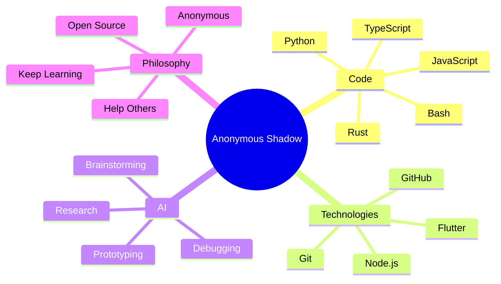

<div align="center">


# 🕶️ Anonymous Shadow

### `Identity unknown. Code speaks for itself.`


</div>

---

## 🌑 About Me

> **A person who wants to help others but does not wish to reveal their identity.**

I am **Anonymous Shadow**, known as `trdarkshadow`.

I build software, experiment with new technologies and use AI as a development partner.

I prefer to stay behind the code rather than behind a name.

---

## 🕸️ My Mind



---

## ⚙️ Languages

<div align="center">


</div>

---

## 🛠️ Tools & Technologies

<div align="center">


</div>

---

## 🤖 AI × Code

```text
                 ┌───────────────┐
                 │      IDEA     │
                 └───────┬───────┘
                         │
                         ▼
                 ┌───────────────┐
                 │   RESEARCH    │
                 └───────┬───────┘
                         │
                         ▼
              ┌─────────────────────┐
              │      AI + HUMAN     │
              └──────────┬──────────┘
                         │
                         ▼
                 ┌───────────────┐
                 │      CODE     │
                 └───────┬───────┘
                         │
                         ▼
                 ┌───────────────┐
                 │ TEST / BREAK  │
                 └───────┬───────┘
                         │
                         ▼
                 ┌───────────────┐
                 │      FIX      │
                 └───────┬───────┘
                         │
                         ▼
                 ┌───────────────┐
                 │      SHIP     │
                 └───────────────┘
```

---

## 🕷️ What I Build

* 🐍 Python tools
* 🌐 JavaScript / TypeScript projects
* 🦀 Rust experiments
* 🖥️ Bash automation
* ⚡ Node.js applications
* 📱 Flutter applications
* 🤖 AI-assisted tools
* 🔧 Open-source utilities
* 🧪 Experimental projects

---

## 📊 Shadow Statistics

<div align="center">


</div>

---

## 🔥 Contribution Streak

<div align="center">


</div>

---

## 🐍 Contribution Snake

<div align="center">


</div>

---

## 👁️ Shadow Visitors

<div align="center">


</div>

---

<div align="center">

### `Anonymous by choice.`

### `Visible through code.`

### `Identity: 404`

<br>


</div>
